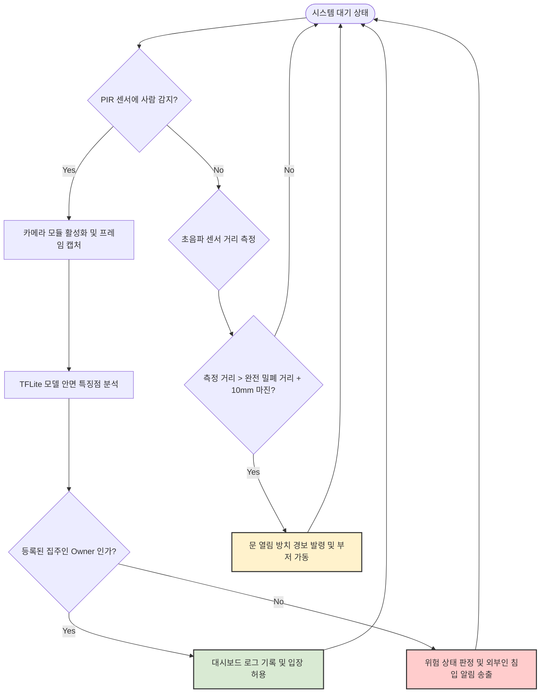

# 제품 요구사항 정의서 (PRD)

## 1. 제품 개요 (Product Overview)
* **제품명**: 마진가드 AIoT (Margin-Guard AIoT)
* **시스템 정의**: 초음파 센서 거리 측정 마진 제어 및 온디바이스 안면 인식 기술 기반의 현관문 스마트 보안 시스템
* **설치 환경**: 1인 가구 원룸, 자취방, 고시원 등 독립 주거 공간의 현관문 내부 및 문틀
* **핵심 가치**: 흔들림으로 인한 오작동 필터링, 프라이버시가 보장되는 자체 인공지능 안면 분류 보안

---

## 2. 문제 정의 (Problem Definition)

### 2.1 개발 배경 및 사용자 페르소나
* **독립 가구의 보안 불안감**: 1인 가구 및 자취 가구가 지속적으로 증가함에 따라, 외부인 침입이나 도어락 오작동에 대응할 수 있는 개인 주거지 보안 시스템의 필요성이 커짐.
* **문 열림 방치 위험**: 외출이나 귀가 시 도어락 걸쇠의 물리적 걸림 등으로 인해 문이 완벽히 닫히지 않고 수 밀리미터에서 수 센티미터가량 살짝 열린 채 방치되는 보안 취약 사례가 빈번함.

### 2.2 현존 시스템의 한계점
* **기존 자석 센서의 한계**: 기존의 자석 부착식 도어 센서는 문이 완전히 열려 자석이 멀어져야만 감지되므로, 문이 미세하게 덜 닫힌 상태를 감지하지 못함.
* **환경 노이즈로 인한 가짜 알림**: 일반 거리 센서는 바람, 미세한 먼지, 문틀의 흔들림으로 인해 측정 데이터가 순간적으로 튀는 현상이 발생함. 이로 인해 문이 닫혀 있음에도 열렸다고 오판하는 가짜 알림이 빈번하여 사용자 피로감을 유발함.
* **상시 촬영형 CCTV의 거부감**: 내부를 상시 녹화하는 홈캠은 거주자의 사생활 유출 우려가 큼. 또한, 단순히 화면 내 움직임만 감지하므로 바람에 흔들리는 커튼이나 그림자에도 무조건 경보를 울려 집주인과 외부인을 지능적으로 구별하지 못함.

### 2.3 해결 방안
* **10mm 소프트웨어 허용 마진(Deadband) 도입**: 초음파 센서의 측정 데이터에 10mm(1cm)의 여유 마진 필터를 적용함. 환경적 요인으로 인한 미세한 흔들림 데이터는 무시하고, 문이 실제로 열려 있는 상태만 정확하게 판정함.
* **PIR 센서 연동 및 온디바이스 AI 구동**: 평소에는 카메라 모듈을 완전히 비활성화하여 사생활을 보호함. PIR 인체 감지 센서에 움직임이 잡히는 순간에만 카메라를 작동시키며, 라즈베리파이 내부(On-Device)에서 TFLite 모델을 통해 등록된 집주인인지 미등록 외부인인지 실시간으로 분류함.

---

## 3. 핵심 사용자 흐름 (User Flow Diagram)

시스템의 전체적인 센서 감지 알고리즘 및 판정 흐름은 다음과 같습니다.

---

## 4. 기능 요구사항 (Functional Requirements)

| 요구사항 ID | 기능 요구사항 명칭 | 상세 사양 (Specification) | 중요도 |
| :--- | :--- | :--- | :--- |
| **FR-01** | 초음파 센서 마진 제어 | 초음파 센서 거리 측정 시, 바람 등 데이터 튐 현상을 막기 위해 10mm(1cm)의 여유 마진 필터 로직을 구현할 것. | **Must-Have** |
| **FR-02** | PIR 연동 카메라 제어 | 평시에는 카메라 촬영을 제한하고, PIR 센서에 움직임 신호(`HIGH`)가 올 때만 즉시 사진을 찍도록 제어할 것. | **Must-Have** |
| **FR-03** | 온디바이스 안면 인식 | 캡처된 사진에서 얼굴 영역을 찾아내고, 라즈베리파이 안에서 TFLite 모델을 돌려 1.5초 이내에 집주인과 외부인을 구별할 것. | **Must-Have** |
| **FR-04** | FastAPI 데이터 저장 | 수집된 센서 값과 AI 판정 결과를 FastAPI 엔드포인트를 통해 SQLite 데이터베이스에 시간과 함께 저장할 것. | **Must-Have** |
| **FR-05** | 실시간 외부 알림 송출 | '미등록 외부인' 판정 및 '문 열림 방치' 상태가 감지되면 연동된 외부 Webhook(디스코드, 슬랙 등)으로 즉시 알림을 보낼 것. | **Must-Have** |
| **FR-06** | 3색 웹 대시보드 시각화 | 웹 화면에 현재 상태를 초록(안전), 노랑(문 열림), 빨강(위험) 3색 인디케이터로 보여주고, 로그 테이블을 실시간으로 업데이트할 것. | **Must-Have** |
| **FR-07** | 사용자 안면 데이터 관리 | 웹 화면을 통해 관리자가 집주인의 사진을 등록하거나 지울 수 있는 관리 기능을 제공할 것. | *Nice-to-Have* |
| **FR-08** | 침입자 스냅샷 파일 저장 | 외부인 감지 시점의 카메라 촬영 프레임 원본을 라즈베리파이 내부 폴더에 보관하고 웹 대시보드 링크로 조회할 수 있게 할 것. | *Nice-to-Have* |

---

## 5. 비기능 요구사항 (Non-Functional Requirements)

* **성능 (Performance)**
  * PIR 센서 감지 시점부터 TFLite 안면 인식 연산 완료 및 FastAPI 서버 저장까지의 총 걸리는 시간은 **1.5초 이내**여야 함.
  * 초음파 센서는 문 상태를 감시하기 위해 최소 0.5초 간격으로 계속 거리를 확인할 것.
* **정확도 (Accuracy)**
  * 10mm 마진 필터를 적용하여 바람이나 문틀 흔들림 때문에 문이 열렸다고 잘못 판단하는 오작동 비율을 **2% 미만**으로 낮출 것.
* **보안 및 프라이버시 (Security & Privacy)**
  * 사용자의 얼굴 사진 분석 및 비교 연산은 외부 인터넷 서버로 보내지 않고, 오직 라즈베리파이 기기 내부(**온디바이스 Edge AI**)에서만 처리하여 외부 유출을 원천 차단함.
* **가용성 및 안정성 (Availability)**
  * 라즈베리파이가 꺼졌다가 다시 켜지더라도 프로그램(FastAPI 및 센서 모니터링 데몬)이 `systemd`를 통해 **자동으로 다시 실행**되어 24시간 작동해야 함.
