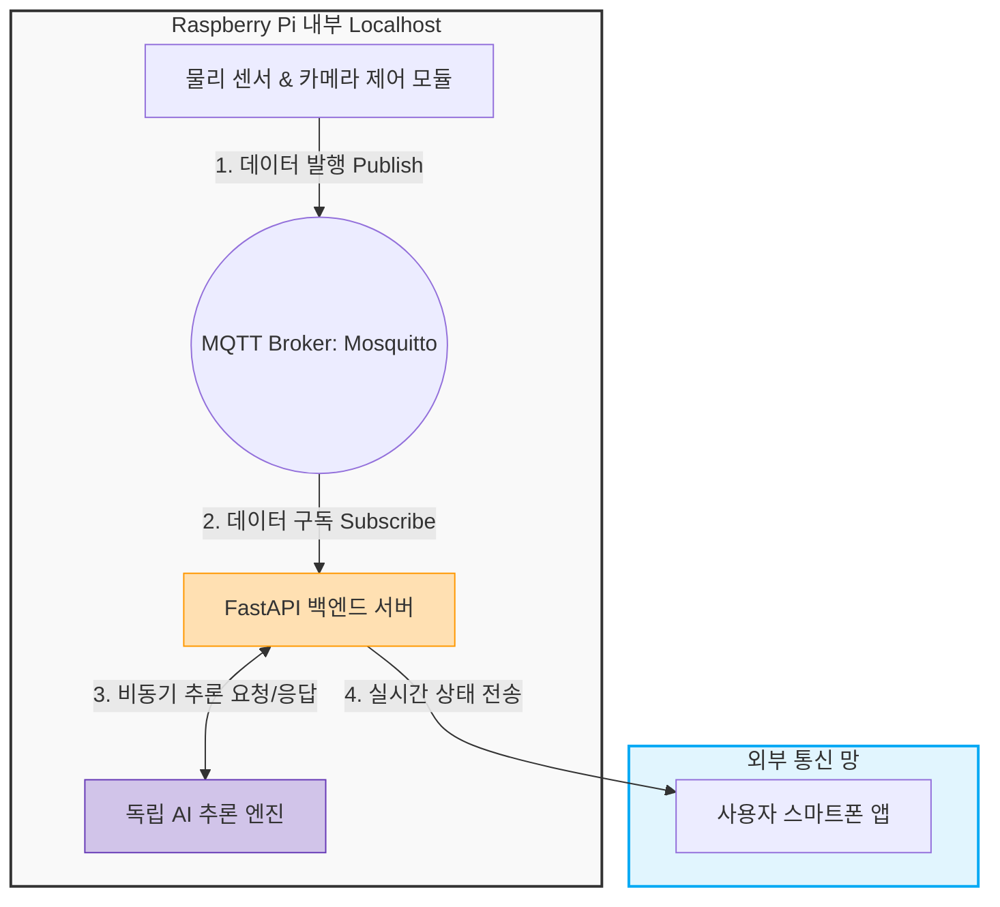
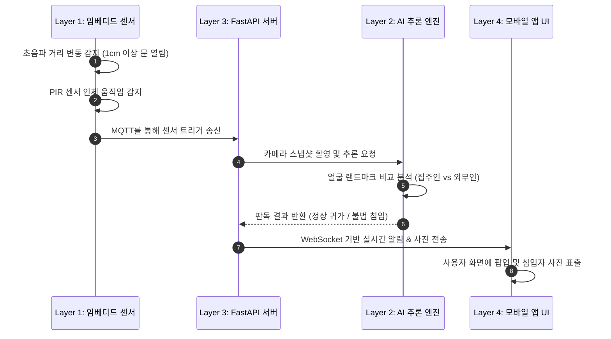

# [Term Project 제안서] 인공지능 IoT 기반 스마트 홈 방범 시스템: 홈가드 (HomeGuard)

**제출일자:** 2026년 5월 27일  
**소속:** 컴퓨터시스템공학과  
**조원:** 학번 / 이름 (역할 분담: AI 비전 및 백엔드 / 임베디드 하드웨어 및 MQTT 통신)  

---

## 1. 프로젝트 개요 및 문제 정의

### 1.1 대상 사용자 및 문제 정의
* **타겟 고객:** 1인 가구, 맞벌이 부부, 장기 출장이 잦은 직장인
* **페인 포인트 (Pain Point):** 기존 홈 CCTV는 단순히 화면을 무조건 녹화하거나 단순 움직임에도 시도 때도 없이 스마트폰 알림을 보내어 '오알림(False Alarm)'이 잦음. 이로 인해 사용자는 알림 피로감을 느끼며, 정작 실제 주거지 무단 침입이 발생했을 때 즉각적인 대응을 놓치는 한계가 있음.

### 1.2 정량적 데이터 기반의 필요성
* 통계청 및 경찰청 치안 데이터에 따르면 1인 가구 대상 주거침입 범죄는 매년 증가 추세에 있음. 
* 스마트 홈 방범 시장의 핵심 트렌드는 "단순 감지"에서 "정확한 식별"로 이동하고 있으며, 불필요한 오알림을 줄이고 외부 침입자와 가족을 정확히 구별하는 지능형 보안 디바이스 수요가 급증하고 있음.

### 1.3 기존 기술 분석 및 차별성
* **기존 기술:** 시중의 도어 센서는 문이 열렸다는 사실만 알릴 뿐, 열고 들어온 사람이 누구인지 파악 불가함.
* **홈가드의 차별성:** 초음파 센서로 문 열림을 1차 감지하고, PIR 센서와 카메라를 연동해 AI 얼굴 인식을 수행함. **가족이면 '귀가 알림', 외부인이면 '침입 경고'**로 이원화하여 사용자에게 꼭 필요한 알림만 스마트폰으로 정확하게 전달함.

---

## 2. 요구사항 정의서 (PRD)

* **초음파 센서 거리 계측:** 현관문과 센서 간 초기 거리를 기준 값으로 설정, 1cm 이상 변동 발생 시 '문 열림'으로 판단.
* **PIR 센서 움직임 감지:** 현관 주변의 인체 열선을 감지하여 카메라 모듈 가동 트리거 송신.
* **AI 얼굴 판독 및 분류:** 촬영된 이미지를 임베디드 내부 AI 모델로 추론하여 등록된 사용자(집주인)와 미등록 사용자(외부인)로 분류.
* **실시간 푸시 알림:** 웹 소켓(WebSocket) 및 앱 알림 API를 통해 실시간 상태(정상 귀가 / 불법 침입) 및 촬영 사진을 외부 스마트폰으로 전송.

---

## 3. 전체 시스템 구성 및 기술 스택

### 3.1 하드웨어 보드 선정: 라즈베리파이 (Raspberry Pi)
* **선정 이유:** 아두이노는 가볍고 저렴하지만, 카메라 영상 이미지 처리 및 AI 얼굴 인식 모델(OpenCV/TFLite)을 온디바이스(On-device)로 구동하기에는 연산 성능(RAM 및 CPU)이 절대적으로 부족함. 따라서 OS(Linux) 위에서 Python 기반의 AI 라이브러리와 비동기 웹 서버를 동시에 안정적으로 구동할 수 있는 라즈베리파이를 메인 보드로 선정함.

### 3.2 기술 스택 (Tech Stack)
* **Embedded:** Python (gpiozero 라이브러리 - 센서 제어용)
* **Network / Protocol:** MQTT (로컬 프로세스 간 독립 통신), WebSocket (외부 스마트폰 실시간 데이터 송신)
* **Backend Server:** FastAPI (비동기 처리로 웹 서버 먹통 방지)
* **AI Engine:** OpenCV + Face Recognition (또는 Light-weight CNN 모델)

---

## 4. 통신 프로토콜 및 모듈 분리 전략 (Decoupling)

컴퓨터시스템공학과 프로젝트에서 가장 중요한 '시스템 독립성'과 '무중단 운영'을 위해 라즈베리파이 내부 프로세스와 외부 스마트폰 통신망을 완전히 이원화하여 설계합니다.

* **내부 통신 (Localhost MQTT):** 센서를 읽는 하드웨어 제어 코드와 백엔드 서버 코드를 별개 프로세스로 실행함. 초음파/PIR 센서가 데이터를 획득하면 기기 내부의 MQTT Broker를 통해 `home/sensor` 토픽으로 데이터를 발행하고, 백엔드가 이를 구독함. AI 연산으로 렉이 걸려도 센서 루프와 서버가 서로 영향을 주지 않는 구조를 확립함.
* **외부 통신 (스마트폰 연동):** 내부에서 가공 완료된 최종 결과(정상 귀가 또는 외부인 침입) 및 촬영된 사진 데이터는 FastAPI 백엔드 서버가 공인 인터넷망을 거쳐 **사용자의 스마트폰 앱(WebSocket 프로토콜)으로 실시간 전송**함. 화면 새로고침 없이 즉각적인 팝업 알림이 가능하도록 구현함.

---

## 5. 4계층(Layer) 기반 데이터 흐름 구조

* **Layer 1 (임베디드/센서):** 라즈베리파이 GPIO에 연결된 초음파 센서(거리 1cm 이상 변화 체크)와 PIR 센서 인터럽트 제어 및 데이터 획득.
* **Layer 2 (AI 추론 엔진):** PIR 감지 시 카메라로 스냅샷 촬영. 웹 서버와 분리된 독립 AI 프로세스에서 이미지 내부의 얼굴 랜드마크를 추출, 기존 등록된 집주인 데이터셋과 비교하여 동일인 여부 판독.
* **Layer 3 (백엔드 서버):** FastAPI 기반. AI 엔진의 판독 결과(정상/침입)를 받아 데이터베이스에 로그를 기록하고, 외부 스마트폰 앱으로 넘겨줄 실시간 알림 서비스 트리거.
* **Layer 4 (모바일 앱 UI):** 사용자 화면. 평소에는 '보안 가동 중' 상태를 실시간으로 보여주다가, 이벤트 발생 시 실시간 푸시 팝업 알림과 함께 촬영된 인물의 사진을 화면에 표출.

---

## 6. 구현 및 테스트 계획 (QA)

### 6.1 단계별 구현 프로세스
* **환경 구축 및 센서 제어:** 라즈베리파이 OS 환경 설정 후 초음파 및 PIR 센서 회로를 구성하고, Python 기반의 센서 데이터 계측 및 하드웨어 인터럽트 제어 코드를 작성함.
* **내부 통신 및 AI 모듈 연동:** 로컬 Mosquitto MQTT Broker를 구축하여 센서-FastAPI 간 메시지 송수신 파이프라인을 연동하고, OpenCV 기반의 경량 얼굴 인식 모델 최적화 및 사용자 데이터셋 등록 로직을 구현함.
* **외부 네트워크 및 UI 통합:** 외부 인터넷망 통신을 위한 네트워크 환경을 설정하고, WebSocket 프로토콜 기반의 실시간 알림 시스템을 모바일 뷰 UI와 최종 통합함.

### 6.2 독립 테스트 및 디버깅 방안
* **모듈별 교차 검증:** 백엔드 서버가 구동되지 않은 상태에서도 로컬 터미널에서 `mosquitto_sub -t home/sensor` 명령어를 독립적으로 실행하여, 하드웨어 단에서 센서 데이터가 유실 없이 실시간으로 발행(Publish)되는지 네트워크 패킷 검증을 선행함.
* **예외 처리:** 현관문이 미세하게 흔들리거나 센서 오차로 발생할 수 있는 1cm 미만의 거리 변화를 필터링하는 데이터 노이즈 제거 알고리즘을 적용하여 시스템의 신뢰성을 확보함.
