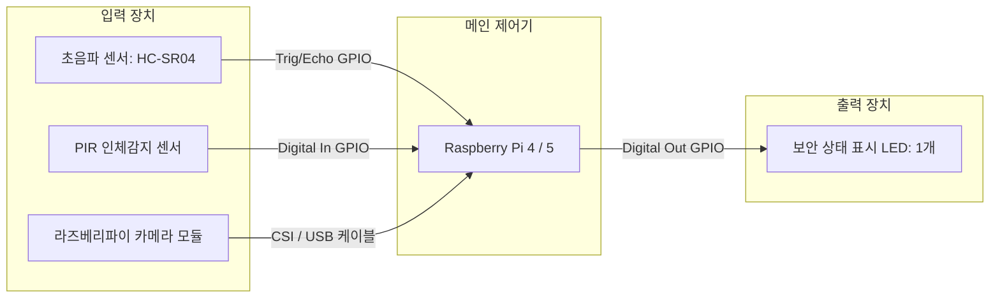
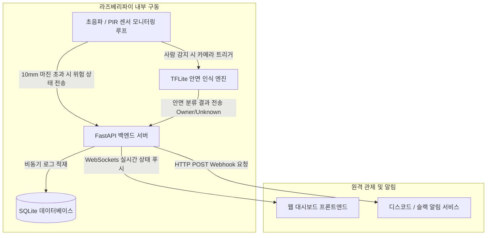

# 2. 시스템 설계 (System Design)

## 2.1 하드웨어(HW) 시스템 구성도

라즈베리파이를 중심으로 입력 센서 2종(초음파, PIR) 및 카메라와 출력 장치인 단일 LED 1개만 연결되는 단순화된 하드웨어 구조입니다.

### 1) HW 블록 다이어그램



### 2) GPIO 핀 매핑 테이블


| 부품명 | 핀 기능 | 라즈베리파이 GPIO 핀 번호 | 비고 |
| :--- | :--- | :--- | :--- |
| **초음파 센서 (HC-SR04)** | Trigger | GPIO 23 (Pin 16) | 출력: 초음파 발생 신호 |
| | Echo | GPIO 24 (Pin 18) | 입력: 전압 분배 저항 적용 (5V -> 3.3V 안전화) |
| **PIR 인체감지 센서** | OUT | GPIO 17 (Pin 11) | 입력: 사람 감지 시 HIGH(3.3V) 신호 발생 |
| **라즈베리파이 카메라** | 데이터 통신 | CSI 포트 또는 USB | 입력: PIR 트리거 시 안면 캡처용 |
| **상태 표시 LED (1개)** | 안면 인식 및 경고 | GPIO 5 (Pin 29) | 출력: 미등록 외부인 감지 또는 문 열림 방치 시 깜빡임(Blink) 경고 |

---

## 2.2 소프트웨어(SW) 구성도

전체 소프트웨어는 라즈베리파이 내부에서 독립적으로 구동되는 백엔드(FastAPI), 데이터베이스(SQLite), 프론트엔드(웹 대시보드)로 구성됩니다.

### 1) 시스템 데이터 흐름도 (Data Flow Diagram)



### 2) 백엔드 (Backend): FastAPI
* **동작 방식**: 비동기 프레임워크를 활용하여 센서 주기적 모니터링과 사용자 웹 요청을 처리합니다.
* **통신 프로토콜**:
  * **HTTP REST API**: 데이터베이스 이력 조회 및 초기 상태 동기화에 사용합니다.
  * **WebSocket**: 현관문 상태 변화 및 AI 분류 결과를 웹 대시보드 화면에 즉시 동기화합니다.
* **배경 태스크 (Background Tasks)**: 웹 서버 백그라운드에서 초음파 거리 측정 및 안면 추론 스크립트를 독립적으로 상시 구동합니다.

### 3) 프론트엔드 (Frontend): 웹 대시보드
* **기술 스택**: Vanilla JS + HTML5 + Tailwind CSS (서버 부하 최소화)
* **디자인 구조**: 가독성을 높이기 위해 단일 페이지(Single Page Template) 구조를 채택합니다.
* **핵심 기능**: 현관문 개폐 유무 시각화 및 실시간 안면 인식 로그 타임라인을 제공합니다.

### 4) 데이터베이스 (DB): SQLite
* **선정 이유**: 임베디드 AIoT 환경에 최적화된 파일 기반 경량 SQL DB로 데이터 분실 위험을 방지합니다.
* **데이터 모델 설계**:

```sql
-- 현관문 상태 및 AI 보안 로그 테이블
CREATE TABLE security_logs (
    id INTEGER PRIMARY KEY AUTOINCREMENT,
    event_type TEXT NOT NULL,         -- DOOR_OPEN(문열림 방치), FACE_OWNER(집주인), FACE_UNKNOWN(외부인)
    measured_distance REAL,           -- 초음파 센서 실측 거리 (mm)
    face_confidence REAL,             -- AI 안면 인식 확률 값 (0.0 ~ 1.0)
    created_at TIMESTAMP DEFAULT CURRENT_TIMESTAMP
);
```