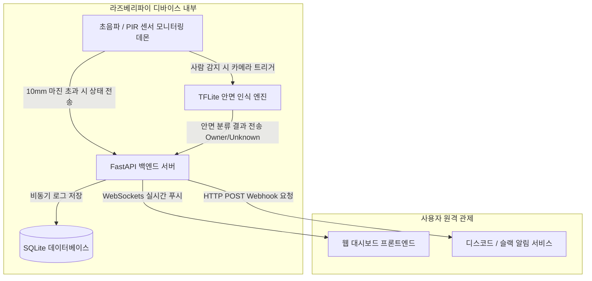

# 2. 시스템 설계 (System Design)

## 2.1 하드웨어(HW) 시스템 구성도

라즈베리파이를 중심으로 입력 센서(초음파, PIR, 카메라)와 출력 장치(부저, LED)가 연결되는 하드웨어 구조입니다. 각 부품은 배선 노이즈를 최소화하도록 GPIO 핀에 직접 매핑됩니다.

### 1) HW 블록 다이어그램

```mermaid
graph LR
    subgraph INPUT_DEVICES [입력 장치]
        HC_SR04[초음파 센서: HC-SR04]
        PIR[PIR 인체감지 센서]
        CAM[라즈베리파이 카메라 모듈]
    end

    subgraph CONTROLLER [메인 제어기]
        RPi[Raspberry Pi 4 / 5]
    end

    subgraph OUTPUT_DEVICES [출력 장치]
        BUZZER[5V 능동형 부저]
        LED[상태 표시 LED: 3색]
    end

    %% 연결 관계
    HC_SR04 -- Trig/Echo GPIO -- > RPi
    PIR -- Digital In GPIO --> RPi
    CAM -- CSI / USB 케이블 --> RPi
    RPi -- Digital Out GPIO --> BUZZER
    RPi -- Digital Out GPIO --> LED
```

### 2) GPIO 핀 매핑 테이블


| 부품명 | 핀 기능 | 라즈베리파이 GPIO 핀 번호 | 비고 |
| :--- | :--- | :--- | :--- |
| **초음파 센서 (HC-SR04)** | Trigger | GPIO 23 (Pin 16) | 출력: 초음파 발생 신호 |
| | Echo | GPIO 24 (Pin 18) | 입력: 전압 분배 저항 필수 (5V -> 3.3V) |
| **PIR 인체감지 센서** | OUT | GPIO 17 (Pin 11) | 입력: 사람 감지 시 HIGH(3.3V) 신호 |
| **능동형 부저 (Buzzer)** | VCC/I/O | GPIO 22 (Pin 15) | 출력: 위험 상황 시 경보음 발생 |
| **상태 표시 LED** | Red (위험) | GPIO 5 (Pin 29) | 출력: 미등록 외부인 침입 시 점등 |
| | Yellow (경고) | GPIO 6 (Pin 31) | 출력: 현관문 미세 열림 방치 시 점등 |
| | Green (안전) | GPIO 13 (Pin 33) | 출력: 정상 밀폐 및 집주인 확인 시 점등 |

---

## 2.2 소프트웨어(SW) 구성도

전체 소프트웨어는 라즈베리파이 내부에서 독립적으로 구동되는 백엔드(FastAPI), 데이터베이스(SQLite), 프론트엔드(대시보드)로 구성됩니다.

### 1) 시스템 데이터 흐름도 (Data Flow Diagram)



### 2) 백엔드 (Backend): FastAPI
* **동작 방식**: ASGI 비동기 프레임워크를 사용하여 센서 데이터 수집 API와 웹 요청을 지연 없이 동시에 처리합니다.
* **통신 프로토콜**:
  * **HTTP REST API**: 센서 상태 저장 및 이력 조회에 사용합니다.
  * **WebSocket**: 현관문 개폐 상태 변경 및 안면 인식 결과를 웹 대시보드에 새로고침 없이 실시간으로 전송합니다.
* **배경 태스크 (Background Tasks)**: 초음파 거리를 주기적으로 재는 루프와 안면 인식을 돌리는 무거운 작업을 메인 웹 서버 흐름과 분리하여 안전하게 실행합니다.

### 3) 프론트엔드 (Frontend): 웹 대시보드
* **기술 스택**: Vanilla JS + HTML5 + Tailwind CSS (경량 AIoT 시스템 최적화)
* **디자인 구조**: 일의 효율을 위해 단일 페이지 대시보드(SPA) 구조를 채택합니다.
* **핵심 컴포넌트**:
  * **상태 카드**: 현재 현관문 연결 및 잠금 상태를 직관적인 색상(녹색/황색/적색)으로 표시합니다.
  * **로그 테이블**: 최신 보안 경보 및 집주인 귀가 이력을 시간순으로 정렬하여 출력합니다.

### 4) 데이터베이스 (DB): SQLite
* **선정 이유**: 파일 기반의 경량 데이터베이스로, 라즈베리파이의 메모리와 디스크 자원을 아주 적게 소모하면서도 높은 안정성을 제공합니다.
* **데이터 모델 설계**:

```sql
-- 1. 현관문 보안 로그 테이블
CREATE TABLE security_logs (
    id INTEGER PRIMARY KEY AUTOINCREMENT,
    event_type TEXT NOT NULL,         -- DOOR_OPEN(문열림), FACE_OWNER(집주인), FACE_UNKNOWN(외부인)
    measured_distance REAL,           -- 초음파 센서로 측정한 실제 거리 (mm)
    face_confidence REAL,             -- AI 안면 인식 정확도 확률 (0.0 ~ 1.0)
    created_at TIMESTAMP DEFAULT CURRENT_TIMESTAMP
);

-- 2. 등록된 사용자(집주인) 프로필 테이블 (Nice-to-Have 확장용)
CREATE TABLE owner_profiles (
    id INTEGER PRIMARY KEY AUTOINCREMENT,
    name TEXT NOT NULL,
    embedding_data TEXT NOT NULL,     -- TFLite 비교용 안면 특징점 벡터 값 (문자열 저장)
    updated_at TIMESTAMP DEFAULT CURRENT_TIMESTAMP
);
```

