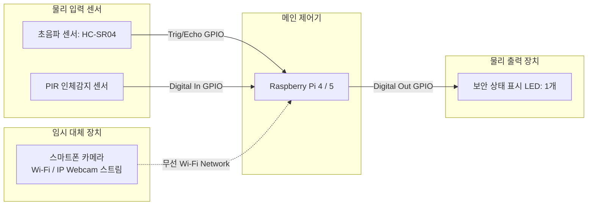
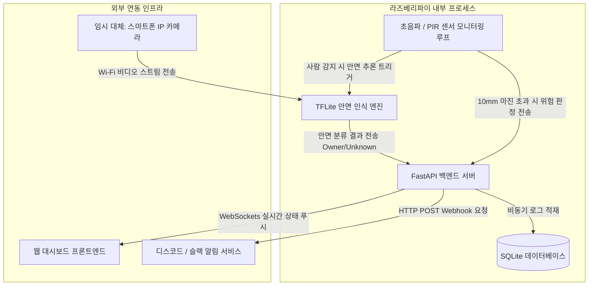

# 2. 시스템 설계 (System Design)

## 2.1 하드웨어(HW) 시스템 구성도

본 시스템은 라즈베리파이를 메인 제어기로 하며, 입력 센서 2종(초음파, PIR) 및 단일 LED 1개를 물리적으로 연결합니다. 단, 안면 캡처용 카메라의 경우 최종 스펙은 '라즈베리파이 카메라 모듈'이나, 현재 프로토타입 검증 단계에 한하여 '스마트폰 카메라(Wi-Fi)' 스트림으로 임시 대체하여 입력 신호를 수신합니다.

### 1) HW 블록 다이어그램



### 2) GPIO 및 네트워크 인터페이스 매핑 테이블


| 부품명 | 핀 기능 / 연결 방식 | 라즈베리파이 연결 정보 | 비고 |
| :--- | :--- | :--- | :--- |
| **초음파 센서 (HC-SR04)** | Trigger | GPIO 23 (Pin 16) | 출력: 초음파 발생 신호 제어 |
| | Echo | GPIO 24 (Pin 18) | 입력: 전압 분배 저항 적용 (5V -> 3.3V 전압 강하) |
| **PIR 인체감지 센서** | OUT | GPIO 17 (Pin 11) | 입력: 사람 감지 시 HIGH(3.3V) 디지털 신호 수신 |
| **상태 표시 LED (1개)** | 경고 및 상태 출력 | GPIO 5 (Pin 29) | 출력: 외부인 침입 및 문 열림 방치 시 깜빡임(Blink) |
| **스마트폰 카메라 (임시)** | Wi-Fi 스트리밍 수신 | 로컬 IP 포트 연동 (예: `http://192.168.x.x:8080/video`) | **물리 카메라 모듈 부재로 인한 임시 대체**, OpenCV를 통한 프레임 캡처 |

---

## 2.2 소프트웨어(SW) 구성도

전체 소프트웨어 아키텍처는 라즈베리파이 내부에서 구동되는 센서 모니터링 데몬, TFLite AI 추론 엔진, FastAPI 백엔드 웹 서버, SQLite 데이터베이스로 분할 설계되었습니다.

### 1) 시스템 데이터 흐름도 (Data Flow Diagram)



### 2) 백엔드 (Backend): FastAPI
* **동작 방식**: 비동기(Asyncio) 프레임워크를 기반으로 설계되어, 실시간 센서 데이터 수집 처리와 사용자 웹 요청 처리가 병렬로 지연 없이 수행됩니다.
* **통신 프로토콜 사양**:
  * **HTTP REST API**: 데이터베이스에 적재된 과거 보안 이력 조회 및 초기 세팅값 제어에 사용됩니다.
  * **WebSocket**: 현관문 개폐 상태 변경 및 AI 안면 분류 결과를 브라우저 화면에 실시간 푸시(Push)하여 새로고침 없는 모니터링을 지원합니다.
* **배경 태스크 (Background Tasks)**: 웹 서버의 메인 스레드가 정지하지 않도록, 초음파 거리를 주기적으로 재는 루프와 스마트폰 카메라 스트림을 감시하는 작업을 백그라운드 스레드로 분리하여 상시 구동합니다.

### 3) 프론트엔드 (Frontend): 웹 대시보드
* **기술 스택**: Vanilla JS + HTML5 + Tailwind CSS (서버 자원 소모 최소화)
* **디자인 구조**: 가독성 및 단일 디바이스 제어 효율성을 위해 단일 페이지(Single Page Template) 구조를 채택합니다.
* **핵심 기능**: 현관문 실시간 개폐 유무 시각화 및 타임라인 형태의 안면 인식 로그 스트리밍을 제공합니다.

### 4) 데이터베이스 (DB): SQLite
* **선정 이유**: 서버 세팅이 필요 없는 파일 기반 경량 SQL 데이터베이스로, 라즈베리파이의 제한된 자원 환경에서 신뢰성 있는 관계형 데이터 적재 메커니즘을 제공합니다.
* **데이터 모델 설계 (DDL)**:

```sql
-- 현관문 개폐 이력 및 AI 보안 로그 통합 테이블
CREATE TABLE security_logs (
    id INTEGER PRIMARY KEY AUTOINCREMENT,
    event_type TEXT NOT NULL,         -- DOOR_OPEN(문열림 방치), FACE_OWNER(집주인), FACE_UNKNOWN(외부인)
    measured_distance REAL,           -- 초음파 센서 실측 거리 (mm)
    face_confidence REAL,             -- AI 안면 인식 신뢰도 확률 값 (0.0 ~ 1.0)
    created_at TIMESTAMP DEFAULT CURRENT_TIMESTAMP
);
```
